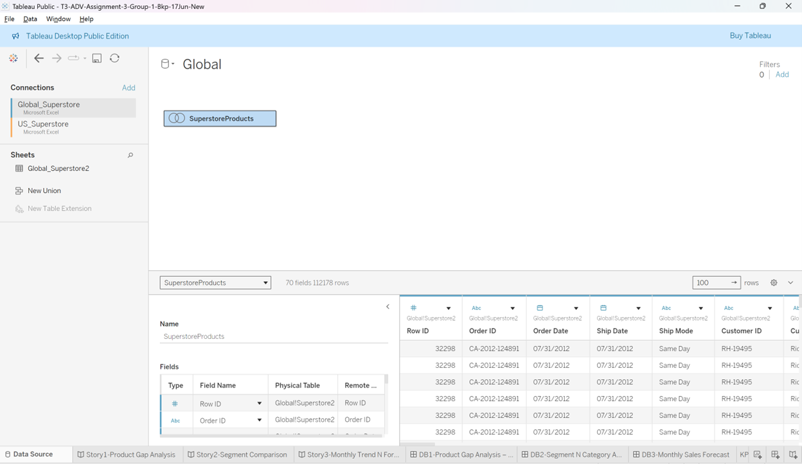
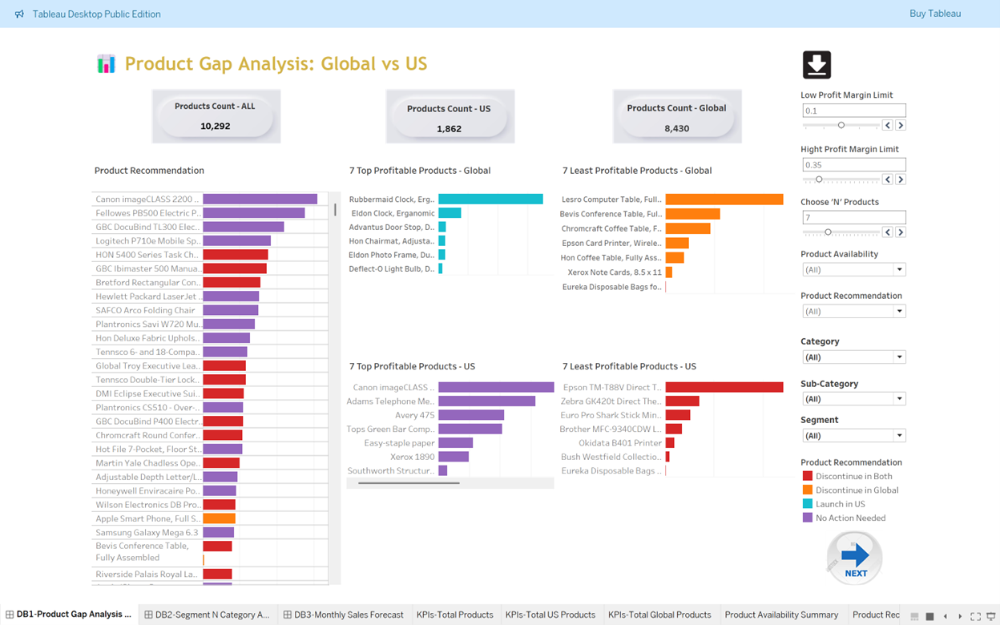
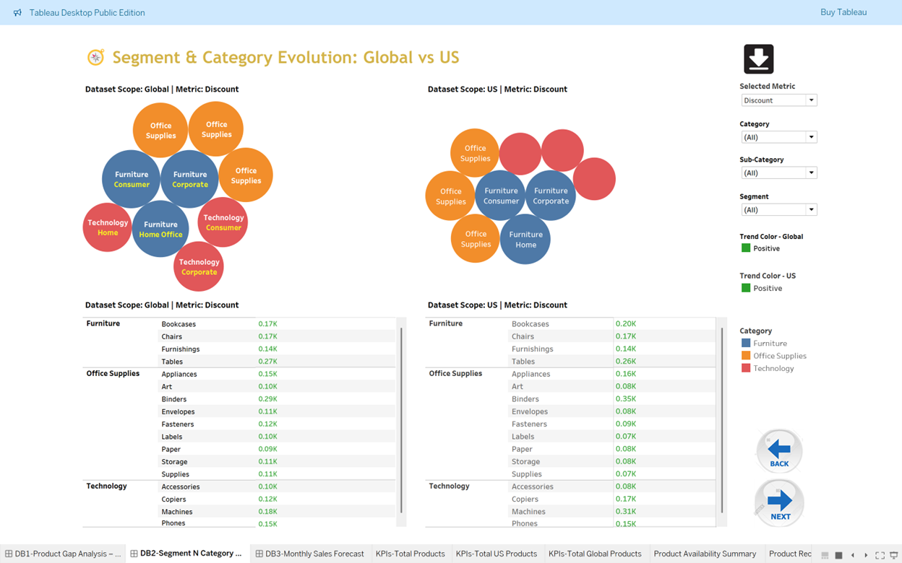
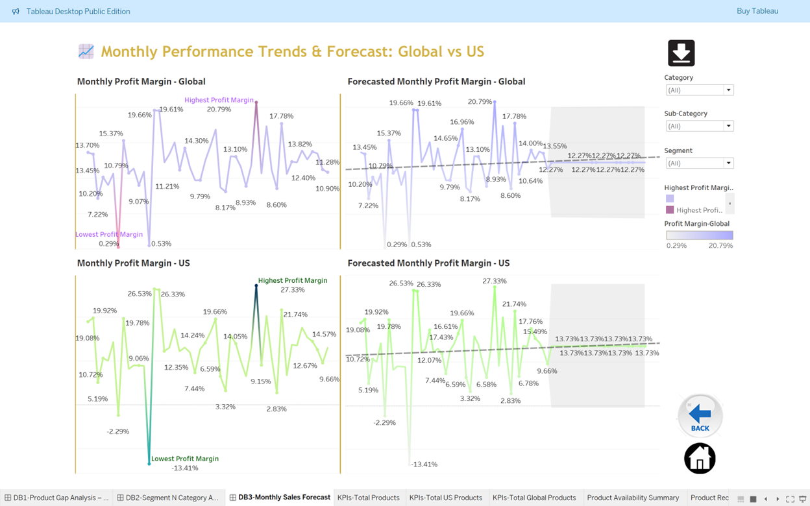
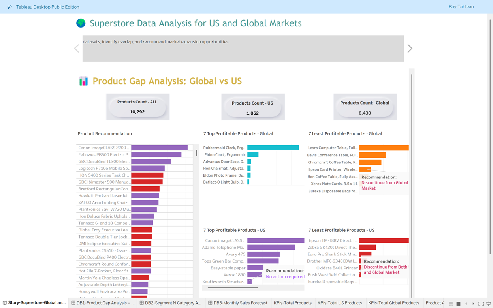
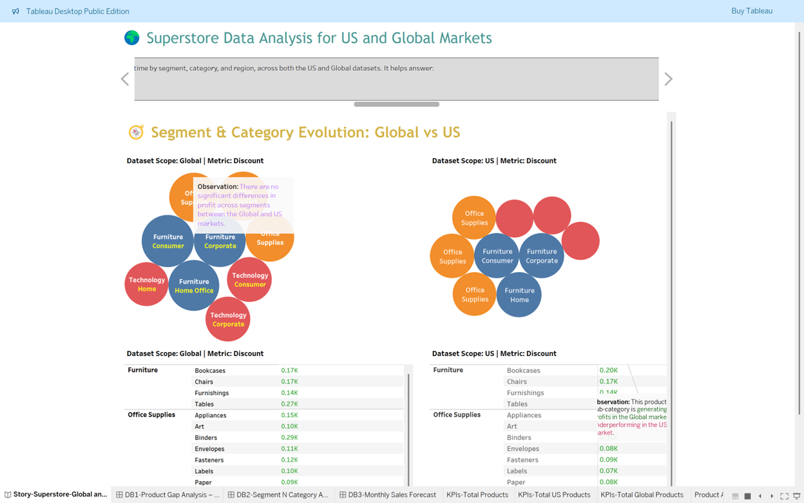
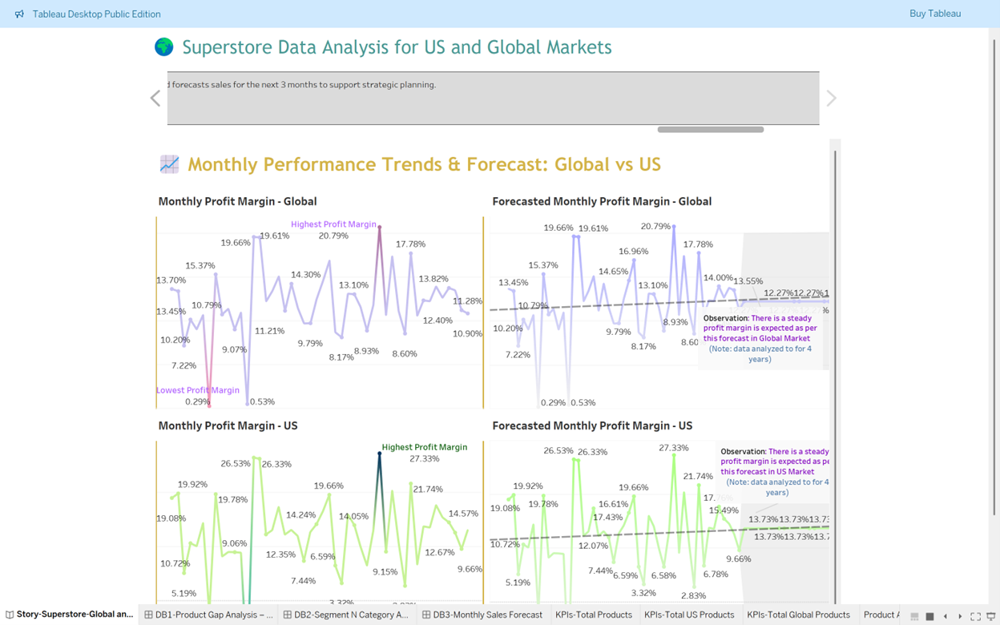

# Superstore-SalesComparision-Global-N-US-Markets
Superstore-SalesComparision-Global-N-US-Markets
# Data Model Design

We imported two datasets covering the Global and US Superstore markets. Since the datasets span different calendar years—and all US products inherently belong to the Global dataset—directly blending them retrieves only the overlapping products. This limited our ability to perform a full comparative analysis. 

To overcome this, we implemented a **full outer join** between the Global and US datasets, ensuring the inclusion of all products from both sources and enabling comprehensive comparative analysis.

---

# Global and US Superstore Dashboards

## 1. Product Gap Analysis: Global vs US

### a. Key Visualizations

- **KPI Tiles**: Display counts of products available in the Global market, US market, and common to both.
- **Bar Chart - Product Recommendations**: Highlights recommended products using color-coded insights.
- **Bar Chart - Top / Least Profitable Products**: Shows profit distribution across products, enabling identification of high- and low-performing items in each market.
- **Filters & Interactivity**: Parameters for profit thresholds, Top 'N' selections, conditional formatting, and dashboard navigation enhance user experience.

### b. Interpretation

- **KPI Insight**:  
  - Total Products: `10,292`  
  - Available in US: `1,862`  
  - Available Globally: `8,430`  
  - Global market offers ~353% more products than the US, indicating significant product portfolio gaps.
  
- **Profitability Trends**:
  - **Top Performers**:
    - *Global*: Rubbermaid Clock, Advantus Door Stop  
    - *US*: Adams Telephone, Avery 475
  - **Least Performers** (common in both): Eureka Disposable, among others.

### c. Strategic Recommendations

1. **Expand US Product Portfolio** to close the gap and tap unmet market potential.
2. **Leverage Global Bestsellers** by adapting them for the US market.
3. **Regionalize Product Strategy** based on local performance insights.
4. **Phase Out Underperformers** globally to streamline offerings.
5. **Deep-Dive Profitability Analysis** for market-specific product success factors.
6. **Optimize Marketing Strategies** using region-specific insights.

---

## 2. Segment and Category Evolution: Global vs US

### a. Key Visualizations

- **Bubble Charts**: Visualize segment-wise performance across metrics.
- **Dynamic Summary Tables**: Indicate up/down trends with auto-updating metrics and formatting.

### b. Interpretation

- **Bubble Charts**: Reveal no major differences in segment performance between markets.
- **Summary Tables**: Certain products excel globally but underperform in the US.

### c. Strategic Recommendations

1. **Invest in Growing Categories** like Technology and Office Supplies.
2. **Address Challenges in Furniture** by analyzing losses and optimizing range.
3. **Strengthen the Consumer Segment** with focused B2C strategies.
4. **Regional Subcategory Optimization** for segments like Technology.
5. **Improve Marginal Subcategories** such as US Office Supplies ‘Supplies’.

---

## 3. Monthly Performance Trends & Forecast: Global vs US

### a. Key Visualizations

- **Line Graphs**: Show historical profit margins and forecasted trends.

### b. Interpretation

- **Global Profit Margins**: Range from `0.53%` to `20.79%`, forecasted to decline to `12.27%`, signaling potential market pressures.
- **US Profit Margins**: Highly volatile (`-2.29%` to `27.33%`) but expected to stabilize around `13.73%`, indicating positive recovery.

### c. Strategic Recommendations

1. **Implement Global Cost Controls** to offset declining margins.
2. **Capitalize on US Market Recovery** with reinforced pricing and operational strategies.
3. **Establish Volatility Monitoring Systems** for both markets.
4. **Enhance Forecast Models** using predictive analytics to support proactive planning.

---

## Superstore Story: Global and US Markets Analysis

This comprehensive comparative analysis of Global vs. US Superstore datasets reveals critical insights into product availability, profitability, and strategic growth areas. Through interactive dashboards and visual analytics, stakeholders can make data-informed decisions to expand product offerings, tailor regional strategies, and optimize overall business performance.

